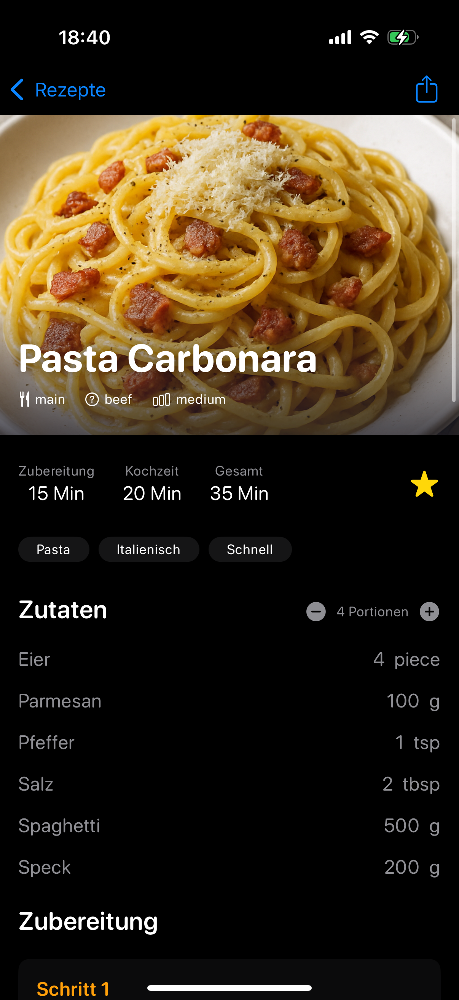
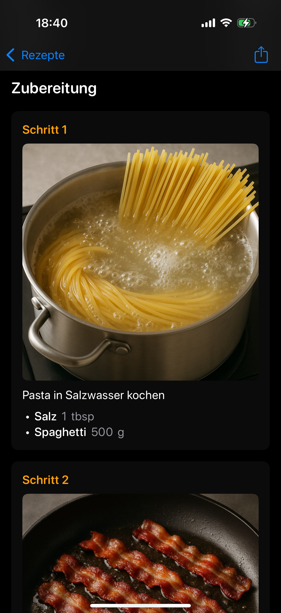

  

# FlavorFactory

**FlavorFactory** is an iOS and iPadOS app for managing and viewing recipes. The app is designed for home cooks and food enthusiasts who want a privacy-friendly and extensible recipe viewer.

> The app is primarily developed by Vibe Coding.

---

## Features

### Implemented
- 📋 **Recipe Viewing**: Browse your recipes in a clean, modern interface
- 🍽️ **Step-by-Step Cooking**: Follow recipes with step instructions and optional images
- 🔄 **JSON Import/Export**: Import and export recipes as portable JSON files (with or without images)
- ☁️ **CloudKit Sync**: Recipes are stored locally and can be synced via iCloud if enabled in your device settings

### Planned
- ✏️ **Recipe Editing and Creation**
- 🏷️ **Tags and Categories**
- 🛒 **Shopping List Generation**
- 📅 **Meal Planning**
- 📊 **Recipe Analytics**
- ⏲️ **Time Tracking**
- 🥗 **Nutritional Information**

---

## Import & Export
- **Export:**  
  Open a recipe and tap the share button to export as JSON
- **Import:**  
  In the recipe list, tap the `+` menu and select "Import Recipe" to import a JSON file
- **Format:**  
  The app uses a modular JSON schema (see `/Export/RecipeDTO.swift`)

---

## Contributing
Contributions are welcome! Please open issues or pull requests for bugfixes, improvements, or new features.

- Follow the [Conventional Commits](https://www.conventionalcommits.org/en/v1.0.0/) style for commit messages
- Code documentation is in English, UI texts are in German
- See the `IDEA.md` for roadmap and technical notes

---

## License
This project is licensed under the [MIT License](LICENSE).

---

## Privacy & CloudKit
- No personal data is collected or transmitted by the app
- Recipes are stored locally and, if iCloud is enabled, synced via your private iCloud container
- All data stays on your device or in your iCloud account

---

## Contact
For questions, feedback, or collaboration, open an issue or contact the maintainer via GitHub.

## Screenshots

| Rezept-Detailansicht | Schritt-Detailansicht |
|----------------------|----------------------|
|  |  | 